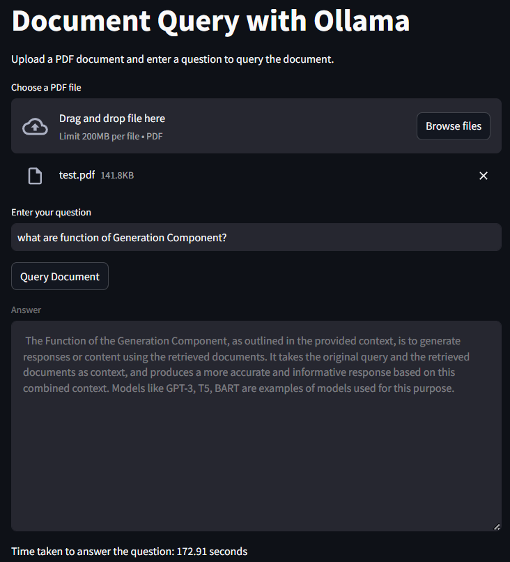

# Rag-Chatbot-LLM
## Project Description

**Rag-Chatbot-LLM** is an integrated question-and-answer system that combines command-line interface (CLI) interactions, web-based file uploads, and database management. This project leverages Retrieval-Augmented Generation (RAG) for enhanced Q&A capabilities and supports various data sources, including PDFs and YouTube video content.

### Key Features

- **CLI-Based Q&A**: Provides real-time Q&A functionality directly from the command line using RAG.
- **Web Interface**: Developed with Streamlit to allow users to upload files and perform Q&A. Includes support for YouTube video content translation.
- **Database Integration**: Utilizes PostgreSQL and ChromaDB for storing and managing data, with table structures defined for PDF storage and retrieval.
- **API Integration**: Implements GROQ API for advanced language model capabilities.

### Tools, Libraries, and Databases Used

- **Programming Languages**: Python
- **Frameworks**: Flask, Streamlit
- **APIs**: GROQ API
- **Databases**: PostgreSQL, ChromaDB
- **Libraries**: RAG, SQLAlchemy, psycopg2
- **Development Tools**: Postman, CLI (Command Line Interface)

## Installation

### Create Virtual Environment
```
pip install virtualenv
virtualenv venv
venv\Scripts\activate
```
### Clone the Repository
```
Git clone https://github.com/Himanshu-codesai/Rag-Chatbot-LLM.git
```
### Install Dependencies
```
pip install -r requirements.txt
```
### Set Up Ollama
- We use Ollama to run the llms model on our local server.
[Download Ollama from here](https://ollama.com/download)

- After Ollama installation , open cmd terminal and put below two commands - 
```
Ollama pull mistral & Ollama pull nomic-embed-text
```
- For more next detailed information, please refer to the [Report.docx](Report.docx).

### Optional Codes
- I have also implemented some code using streamlit & Groq based implementation of RAG.



